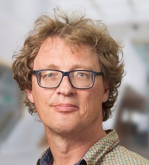

<table border=1><tbody>

<tr><td width="180">name</td><td>
Wouter Olaf van Ooijen
</td></tr>

<tr><td>contact</td><td>
wouter@voti.nl
</td></tr>

<tr><td>born</td><td>
18 september 1962, Gouda, Netherlands
</td></tr>

<tr><td>home</td><td>
Amersfoort, Netherlands
 
Permanent relocation is not an option, remote work and periodic trips are.
</td></tr>

<tr><td>availability</td><td>
employed, in for a next step
</td></tr>

<tr><td>highest education</td><td>
university, TU Delft, Informatics (Computer Science)
</td></tr>

<tr><td>keywords</td><td>
C++, Python, C, assembler, Ada, Java, 
embedded, real-time, resource-constrained, electronics,
system design, lecturer, team leader,
Linux, micro-controller, Cortex-M, Microchip PIC, 
Arduino, 
make, git, catch2, doxygen, 
industrial, space, military, 
C++ SG14, Meeting C++, Meeting Embedded, ACCU, EmBo++, CoreHard, The Dutch C++ group
</td></tr>

<tr><td>file location</td><td>
https://www.github.com/wovo/cv
</td></tr>

</tbody></table>

<!--- --------------------------------------------------------------------- -->

## Profile

<!--- --------------------------------------------------------------------- -->

## Work

<table border=1><tbody>

<tr><td width="180">period</td><td>
2004 - present
</td></tr>

<tr><td>function</td><td>
senior lecturer
</td></tr>

<tr><td>organization</td><td>
Hogeschool Utrecht, HBO-ICT, Technische Informatica (Computer Science)
</td></tr>

<tr><td>location</td><td>
Utrecht; Netherlands
</td></tr>

<tr><td colspan = 2>
I work at the section Technical Informatics (Computer Science) 
of the HBO-ICT institute, where
I am overall responsible for the 1.5 years of TI curriculum.
I coach and guide colleagues, create course material, 
give lectures, guide and supervise students, and run the lab.
My specialization is programming small embedded (micro-controllers) systems in C++.
</td></tr>

</tbody></table>

<!--- --------------------------------------------------------------------- -->

<table border=1><tbody>

<tr><td width="180">period</td><td>
2001 - present
</td></tr>

<tr><td>function</td><td>
owner
</td></tr>

<tr><td>organization</td><td>
VOTI
</td></tr>

<tr><td>location</td><td>
Amersfoort; Netherlands
</td></tr>

<tr><td colspan = 2>
I run a webshop for microcontroller chips and related products. 
My customers range from entry-level hobbyists to small-scale professionals, 
the occasional a large company or a school. 
  

I also did some freelance jobs that are mentioned below, 
contract embedded software development, and due-dilligence code base audits.
</td></tr>

</tbody></table>

<!--- --------------------------------------------------------------------- -->

<table border=1><tbody>

<tr><td width="180">period</td><td>
2001 - 2002
</td></tr>

<tr><td>function</td><td>
tester, programmer
</td></tr>

<tr><td>organization</td><td>
NLR (from VOTI)
</td></tr>

<tr><td>location</td><td>
Markenesse, Amsterdam; Netherlands
</td></tr>

<tr><td colspan = 2>
MPTE is a visual simulator of the ERA robot arm, 
the space station on which the robot is used, 
and the environment of the space station (sun, moon, earth, stars). 
MPTE is used for mission preparation and for cosmonaut training.
  

I created automated test procedures for a number of simulation models developed at LNR. 
The procedures test both the functionality and the test path coverage (using Tcat-Path). 
I also rewrote and corrected the model code and wrote (or rewrote) the detailed designs.
</td></tr>

</tbody></table>

<!--- --------------------------------------------------------------------- -->

<table border=1><tbody>

<tr><td width="180">period</td><td>
1999 - 2001
</td></tr>

<tr><td>function</td><td>
system engineer
</td></tr>

<tr><td>organization</td><td>
Hollandse Signaal / Thales (from ICT)
</td></tr>

<tr><td>location</td><td>
Huizen; Netherlands
</td></tr>

<tr><td colspan = 2>
SmartNet is a communication system designed for military purposes. 
Its original intended use was as a voice and data communication system 
in military vehicles (tanks), either stand-alone or in groups (headquarters). 
An important civil customer is the NS (Dutch railways) where it is used to carry video, 
voice and data over the existing glass fiber infrastructure.
  

I contributed to the system design of SmartNet, 
especially the interface definitions, the testability, 
the transport of synchronous data and the scalability. 
I created a tool that can be used to assess the feasibility 
of a SmartNet configuration.
</td></tr>

</tbody></table>

<!--- --------------------------------------------------------------------- -->

<table border=1><tbody>

<tr><td width="180">period</td><td>
1995 - 1998
</td></tr>

<tr><td>function</td><td>
system engineer
</td></tr>

<tr><td>organization</td><td>
Fokker Space / Dutch Space (from ICT)
</td></tr>

<tr><td>location</td><td>
Leiden; Netherlands
</td></tr>

<tr><td colspan = 2>
The European Robotic Arm (ERA) is a robot arm for the Russian section 
of the international space station ISS. 
As the prime contractor Fokker Space is responsible for the system design, 
the project management and the integration and testing of the total system.
  

I worked mainly on the central computer of the arm 
and on the datacommunication within the arm. 
Critical aspects were the performance of the processor 
and the reliability of the (Ada) compiler. 
Contacts with the subcontractors (SAAB, DASA, CRI/Matra, Tecnospazio, Alsys/Aonix) 
were an important part of my work. 
I also worked on the automated testing facility for 
the engineering model of the central computer.
</td></tr>

</tbody></table>

<!--- --------------------------------------------------------------------- -->

<table border=1><tbody>

<tr><td width="180">period</td><td>
1994 - 1995
</td></tr>

<tr><td>function</td><td>
programmer, team leader
</td></tr>

<tr><td>organization</td><td>
NCR (from ICT)
</td></tr>

<tr><td>location</td><td>
Amsterdam; Netherlands
</td></tr>

<tr><td colspan = 2>
A cheque processing system was adapted for the Dutch situation. 
The system consisted of an optical cheque reader, a database system, 
an OCR engine, an number of data entry terminals and a mainframe connection.
  

I worked as (C/C++) programmer and as team leader.
</td></tr>

</tbody></table>

<!--- --------------------------------------------------------------------- -->

<table border=1><tbody>

<tr><td width="180">period</td><td>
1989 - 1994
</td></tr>

<tr><td>function</td><td>
programmer, designer, trainer, team leader
</td></tr>

<tr><td>organization</td><td>
ICT Automatisering
</td></tr>

<tr><td>location</td><td>
Rotterdam; Netherlands
</td></tr>

<tr><td colspan = 2>
DM90 is a real-time data-communication and data-acquisition product, 
sold mainly to for industrial process control (AKZO, DSM, ALDEL). 
A DM90 is a real-time DEC VAX with software developed by ICT 
that handles the communication with various industrial control systems 
(Honeywell, TDC, Siemens, AEG, SattControl). 
A DM90 gathers and stores real-time data and presents 
this data in a uniform way to a VAX-VMS system.
  
I worked as (E-Pascal, C, Fortran) programmer, designer, trainer and as team leader.
</td></tr>

</tbody></table>

<!--- --------------------------------------------------------------------- -->

<table border=1><tbody>

<tr><td width="180">period</td><td>
1988 - 1989
</td></tr>

<tr><td>function</td><td>
designer, programmer
</td></tr>

<tr><td>organization</td><td>
St Elisabeth Hospital
</td></tr>

<tr><td>location</td><td>
Leiderdorp; Netherlands
</td></tr>

<tr><td colspan = 2>
The hospitals laboratory performs analysis on blood samples. 
The analysis requests are provided by the hospitals mainframe. 
The majority of the analysis are performed on automated analysis machines.
  
I designed, implemented (TurboPascal) and introduced a network of PCs. 
One PC gets the requests from the mainframe, and feeds the authorized result back. 
The other PCs are each coupled to one or more analysis machines 
and receive the analysis results via RS-232 interfaces. 
These PCs are also used to select the analysis that are 
to be performed and to authorize the results.
</td></tr>

</tbody></table>

<!--- --------------------------------------------------------------------- -->

# Education

<table border=1><tbody>

<tr><td width="180">period</td><td>
1981 – 1988
</td></tr>

<tr><td>degree name</td><td>
MSc (Dutch: ir) Informatics (Computer Science)
</td></tr>

<tr><td>organization</td><td>
Technische Universiteit Delft
</td></tr>

<tr><td colspan = 2>
Member and chair of the student club "de Delftsche Zwervers".
  
Student-assistant for three programming courses: 
Pascal, PDP-11 assembler, numerical algorithms.
</td></tr>

</tbody></table>

<!--- --------------------------------------------------------------------- -->

<table border=1 width="100%"><tbody>

<tr><td width="180">period</td><td>
1977 – 1981
</td></tr>

<tr><td width="100%">degree name</td><td>
IVO MAVO, VWO (state exam)
</td></tr>

<tr><td>organization</td><td>
Vrije School Den haag
</td></tr>

</tbody></table>

<!--- --------------------------------------------------------------------- -->

# Talks

These are my talks and appearances that have been recorded.
Most are on the subject of using modern C++ for small embedded systems.

* ["We stopped teaching C++"](https://www.youtube.com/watch?v=VZUTJ2UNXxI) 
   (with Jorn Bunk) Meeting Embedded 2019
* ["Better embedded library interfaces with modern C++"](https://www.youtube.com/watch?v=ArRuPzN7JXs) 
   ACCU 2019
* ["Grill the committee"](https://www.youtube.com/watch?v=OY_mS2e4XTk) 
   CoreHard Spring 2018
* ["Objects? No thanks!"](https://www.youtube.com/watch?v=GcfqHT4RtWc)
   CoreHard Spring 2018 Keynote
* ["Embedded & C++"](https://www.youtube.com/watch?v=mNPfsUZb3vs)
   Meeting C++ 2017 Keynote
* ["C++ on small micro controllers"](https://www.youtube.com/watch?v=07d5g7Ykgas) 
   Meeting C++ 2015   
* ["Objects? No Thanks!"](https://www.youtube.com/watch?v=k8sRQMx2qUw)
   Meeting C++ 2014   

<!--- --------------------------------------------------------------------- -->

# Miscellaneous

<table border=1><tbody>

<tr><td width="180">languages</td><td>
Dutch (native), English
</td></tr>

<tr><td>hobbies</td><td>
Natural history (water insects, mushrooms)
</td></tr>

<tr><td>sports</td><td>
Badminton (thesaurier and chair of Badminton Club Leiden)
</td></tr>

</tbody></table>
